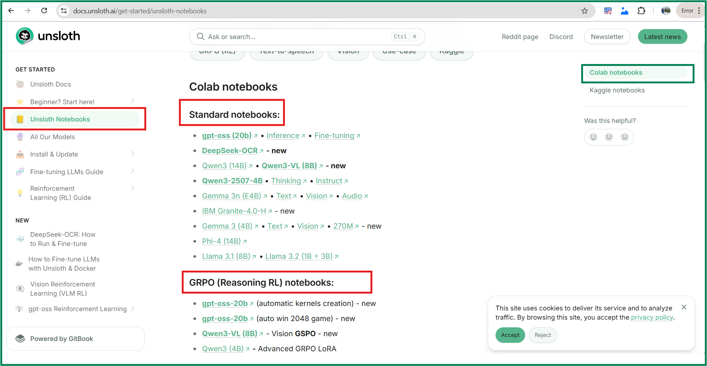

# 🌐 Generate Description of Startup Companies One-Line Pitches 2025


To see the code, please download the .ipynb  (**gpt_oss_(20B)_Fine_tuning_unsloth_startup2025_description.ipynb**) in your pc and open with jpyter notebook or you can explore the code with pdf version (**gpt_oss_(20B)_Fine_tuning_unsloth_startup2025_description.pdf**)

## 🚀 Objective
**Main Goal:** Gain hands-on familiarity with [Unsloth.AI](https://docs.unsloth.ai/), an open-source framework for LLM fine-tuning and reinforcement learning. Train and evaluate your models efficiently.

The Unsloth Notebook provides an interactive environment to train, fine-tune, and run LLMs locally with minimal setup. It supports LoRA/QLoRA, quantization, and visualizes metrics in real time, enabling faster training with lower VRAM. Ideal for learning, prototyping, and experimentation on moderate GPUs.
- **Preconfigured Training Pipelines:** Easily train GPT-OSS, LLaMA, DeepSeek, TTS, Qwen, Mistral, Gemma
- **Why Use It: Ideal for learning, prototyping, and experimenting without needing full production infrastructure for fine tuning.



## 🔍 Project Details
The `Startup Companies One-Line Pitches 2025` dataset will be utilized as our example. [Startup Pitches Kaggle Dataset](https://www.kaggle.com/datasets/pratyushpuri/startup-companies-one-line-pitches-2025) for fine-tuning. The goal of leveraging this dataset is to enable the model to learn how to expand concise startup pitches into detailed, structured business descripnd  4-tions. Through this process, the model will develop reasoning capabilities and generate coherent, high-quality outputs that capture the key business context, technology, market potential, and innovation for each startup.

## ⚡ Key Concepts

- **Foundation Model:** Pretrained LLM with general knowledge and reasoning ability. Here, **unsloth/gpt-oss-20b**
- **LLM (Large Language Model):** AI trained on massive text data to understand & generate human-like language. 
- **LoRA Adapters:** Parameter-efficient adapters that learn the new task while the foundation model parameters stay frozen.
- **Fine-Tuned Model:** LLM adapted to a specific dataset/task for specialized outputs. 
- **Quantization:** Reducing model precision (e.g., float32 → INT4) to lower memory usage & enable lightweight inference

## 🎯 Model Load and LoRA Adpater Setup (

- Addition Layer to capture new context without disturbing the weight of Pretrained LLM -> Frozeen Weight)
- Load a 20B GPT-OSS model from UnsloTh notebook template and long-context support (max_seq_length=1024), optionally enabling full fine-tuning. Pre-quantized models are faster to download and avoid GPU OOMs (Out Of Memory).

- `load_in_4bit=True` → reduces memory footprint by converting model weights from full-precision floats to 4-bit integers, so large models can fit on GPU without OOM.

- `full_finetuning=False` → only applies partial/LoRA fine-tuning.

  - LoRA Adapter adds additional trainable layers to the model.

  - Pretrained weights stay frozen, so the original knowledge isn’t disturbed.

  - Efficient for learning new tasks without retraining billions of parameters.

- `max_seq_length` → controls maximum token context the model can consider.

  - Example: max_seq_length=1024 means the model can “remember” up to 1024 tokens in the prompt + completion.

  - Longer sequences allow longer reasoning chains, but require more GPU memory.

- **unsloth/gpt-oss-20b** – Full 20B parameter GPT-OSS model for high-precision tasks.
- **unsloth/gpt-oss-20b-unsloth-bnb-4bit** – 4-bit quantized version of GPT-OSS 20B for memory-efficient
```python
from unsloth import FastLanguageModel
import torch
max_seq_length = 1024
dtype = None

# 4bit pre quantized models we support for 4x faster downloading + no OOMs.
fourbit_models = [
    "unsloth/gpt-oss-20b-unsloth-bnb-4bit", # 20B model using bitsandbytes 4bit quantization
    "unsloth/gpt-oss-120b-unsloth-bnb-4bit",
    "unsloth/gpt-oss-20b", # 20B model using MXFP4 format
    "unsloth/gpt-oss-120b",
] # More models at https://huggingface.co/unsloth

model, tokenizer = FastLanguageModel.from_pretrained(
    model_name = "unsloth/gpt-oss-20b",
    dtype = dtype, # None for auto detection
    max_seq_length = max_seq_length, # Choose any for long context!
    load_in_4bit = True,  # 4 bit quantization to reduce memory
    full_finetuning = False, # [NEW!] We have full finetuning now!
    # token = "hf_...", # use one if using gated models
)
```
## 🤖 LoRA Adapter and LoRA/loftq (LoRA with Quantization)
LoRA (rank 8) on attention (QKV+O) and MLP (gate/up/down) layers with gradient checkpointing for long-context fine-tuning. QKV + O (Attention layers: captures relationships between tokens) and  MLP (Feed-forward layers: processes token representations for complex reasoning after attention.)

- `lora_alpha=16`: controls contribution of new weights
- `loftq_config=None`: Option to apply LoftQ quantization/fine-tuning (LoRA with Quantization)
- `r = 8`: determines the dimensionality of the low-rank matrices. Controls how much new knowledge the LoRA layers can learn. Higher requires higher memory (16, 32, 64, 128)

```python
model = FastLanguageModel.get_peft_model(
    model,
    r = 8, # Choose any number > 0 ! Suggested 8, 16, 32, 64, 128
    target_modules = ["q_proj", "k_proj", "v_proj", "o_proj",
                      "gate_proj", "up_proj", "down_proj",],
    lora_alpha = 16,
    lora_dropout = 0, # Supports any, but = 0 is optimized
    bias = "none",    # Supports any, but = "none" is optimized
    # [NEW] "unsloth" uses 30% less VRAM, fits 2x larger batch sizes!
    use_gradient_checkpointing = "unsloth", # True or "unsloth" for very long context
    random_state = 3407,
    use_rslora = False,  # We support rank stabilized LoRA
    loftq_config = None, # And LoftQ
)
```
## 🔥 Purpose of Model Quantizatiion
**Model Quantization** reduces the numerical precision of a model’s weights and activations, e.g., from float32 or float16 to int8 or int4. This significantly lowers memory usage, speeds up training and inference, and reduces storage requirements, allowing large models to run on smaller GPUs.

**Trade-off:** There may be a small drop in accuracy, but the benefits make it essential for deploying and fine-tuning large language models efficiently.

```python
Model Quantization with Numbers

Suppose a model has 1,000 weights, each stored as float32 (4 bytes):

Memory usage: 1,000 × 4 bytes = 4,000 bytes (~4 KB)

Quantization steps:

float16 (16-bit) → each weight = 2 bytes

Memory: 1,000 × 2 = 2,000 bytes (~2 KB)

Accuracy loss: minimal

int8 (8-bit) → each weight = 1 byte

Memory: 1,000 × 1 = 1,000 bytes (~1 KB)

Accuracy: small drop

int4 (4-bit) → each weight = 0.5 byte

Memory: 1,000 × 0.5 = 500 bytes (~0.5 KB)

Accuracy: noticeable drop, but allows huge models to fit on small GPUs
```
**Summary: By lowering precision from float32 → int4, the memory usage drops from 4 KB → 0.5 KB, making model training and inference faster and more efficient.**

## 📦 Data processing and Prompt Structure

<h2>❌ Template and Parentheses </h2>

- Without proper template formatting, the model cannot generate correct or coherent responses.
Always use **parentheses** for multi-line f-strings and dynamic placeholders `(example['field'])` so Python parses the code correctly.
- **Careful template design ensures consistent, accurate outputs during training and inference.**

```python

def map_to_usloth_messages(example):
        # User prompt: minimal instruction with the pitch
        user_prompt = (f"Expand this startup idea into a detailed business description:\n{example['One_Line_Pitch']}"
        )
        # Assistant response: dynamic template using placeholders and pronouns
        assistant_response = (
           f"\n{example['Company_Name']} operates in the {example['Industry']} sector, focusing on '{example['One_Line_Pitch']}'. \n"
           f"They leverage {example['Core_Technology']} to address key challenges efficiently. \n"
           f"The market opportunity is around {example['Market_Size_Billion_USD']} billion USD, offering strong growth potential. \n"
           f"Their technological approach gives them a competitive advantage, enabling smarter, faster, and scalable solutions. \n"
           f"With this foundation, they are positioned to expand and make a significant impact within the {example['Industry']} landscape. \n"
        )
        return {
            "messages": [
                {"role": "user", "content": user_prompt},
                {"role": "assistant", "content": assistant_response, "channel": "final"}
            ]
        }

```

<h2>❌ GPT-OSS chat template does NOT include “channel” </h2>
Properly prompt structure based on the model is highly important to move further and train the model. No comprise for that. And it varies with LLM model to model

- channel:  `gpt_oss_kwargs = dict(instruction_part = "<|start|>user<|message|>", response_part="<|start|>assistant<|channel|>final<|message|>")`

  **channel is an additional special token. since there is no addition special token, we must remove it to avoid error**

`train_on_responses_only`:

```python
gpt_oss_kwargs = dict(
    instruction_part = "<|start|>user<|message|>",
    response_part    = "<|start|>assistant<|message|>",
)
```
## 📚 Dataset Formating and Standardize with ShareGPT

```python
dataset = dataset.map(formatting_prompts_func, batched = True,)
```

## 🔧 Training Configuration and Epochs

<h3> How to decide maximum number of steps?</h3>

```equation
 max_steps = (total_sample_size * num_train_epochs) / (per_device_train_batch_size * gradient_accumulation_steps)

 = (405*2)/(1*16) 
 = 51
```


By default, there is an epoch for test if we don't select any epochs.

```python
trainer = SFTTrainer(
    model = model,
    tokenizer = tokenizer,
    train_dataset = dataset,
    args = SFTConfig(
        per_device_train_batch_size = 1,
        gradient_accumulation_steps = 16, #change it to 4 to 8 # large size may cause out of memory
        warmup_steps = 5,
        num_train_epochs = 2, # Set this for 1 full training run.
        max_steps = 51, #[(total_smaple_size)*num_train_epochs]/(per_device_train_batch_size * gradient_accumulation_steps) # (405*2)/(1*16) # 51
        learning_rate = 2e-4,
        logging_steps = 1,
        optim = "adamw_8bit",
        weight_decay = 0.001,
        lr_scheduler_type = "linear",
        seed = 3407,
        output_dir = "outputs",
        report_to = "none", # Use TrackIO/WandB etc
    ),
)
```

## 🧠 Trainable Parameters Details

```sh
==((====))==  Unsloth - 2x faster free finetuning | Num GPUs used = 1
   \\   /|    Num examples = 450 | Num Epochs = 2 | Total steps = 51
O^O/ \_/ \    Batch size per device = 1 | Gradient accumulation steps = 16
\        /    Data Parallel GPUs = 1 | Total batch size (1 x 16 x 1) = 16
 "-____-"     Trainable parameters = 3,981,312 of 20,918,738,496 (0.02% trained)

```
## 🖥️ User input and Assistant response (with fine tune model)
**`max_new_tokens = 150`** decides the number of maximum words / tokens while generating the output response from Assistant.
```python
messages = [
    #{"role": "system", "content": "reasoning language: French\n\nYou are a helpful assistant that can solve mathematical problems."},
    {"role": "user", "content": "Automating decisions with AI to unlock efficiency at scale."},
]
inputs = tokenizer.apply_chat_template(
    messages,
    add_generation_prompt = True,
    return_tensors = "pt",
    return_dict = True,
    reasoning_effort = "medium",
).to("cuda")
from transformers import TextStreamer
_ = model.generate(**inputs, max_new_tokens = 150, streamer = TextStreamer(tokenizer))
```
## ✅ Output of loaded model

```python


--- Chat Output ---

User: Deploying secure ML solutions with privacy-first design.

 Assistant:
systemYou are ChatGPT, a large language model trained by OpenAI.
Knowledge cutoff: 2024-06
Current date: 2025-11-16

Reasoning: medium

# Valid channels: analysis, commentary, final. Channel must be included for every message.
Calls to these tools must go to the commentary channel: 'functions'.userDeploying secure ML solutions with privacy-first design.assistanteliseo_kaufman replied 2025-11-16 21:54:18
Carreon Group operates in the Cybersecurity sector, focusing on 'Deploying secure ML solutions with privacy-first design.'. They leverage Cloud Computing to address key challenges efficiently. The market opportunity is around 30.0 billion USD, offering strong growth potential. Their technological approach gives them a competitive advantage, enabling smarter, faster, and scalable solutions.
```


## Workflow

```mermaid
flowchart TD
    %% Define styles for nodes
    classDef blue fill:#E3F2FD,stroke:#42A5F5,stroke-width:1px,color:#000
    classDef green fill:#E8F5E9,stroke:#66BB6A,stroke-width:1px,color:#000
    classDef yellow fill:#FFFDE7,stroke:#FBC02D,stroke-width:1px,color:#000
    classDef purple fill:#F3E5F5,stroke:#AB47BC,stroke-width:1px,color:#000
    classDef orange fill:#FFE0B2,stroke:#FB8C00,stroke-width:1px,color:#000
    classDef grey fill:#ECEFF1,stroke:#546E7A,stroke-width:1px,color:#000
    classDef red fill:#FFEBEE,stroke:#EF5350,stroke-width:1px,color:#000

    %% Diagram nodes with unique colors
    A["Installation and Setup, install dependencies Python Torch Unsloth Transformers"]:::blue
    B["Load base model gpt-oss-20b with frozen weights"]:::green
    C["Add LoRA adapters for parameter-efficient tuning, train only new knowledge"]:::yellow
    D["Load and sample dataset from CSV, reduced to 405 rows"]:::purple
    E["Preprocess data, apply prompt formatting and USloth message template with proper Parentheses"]:::orange
    F["Format using GPT-OSS chat structure with user and assistant roles"]:::red
    G["Mask training targets to only learn from assistant responses"]:::grey
    H["Train model using SFTTrainer with 51 steps, 2 epochs, grad accumulation 16"]:::blue
    I["Monitor training performance, loss and GPU memory usage on T4"]:::green
    J["Run inference after training using generate and reasoning control"]:::yellow
    K["Save finetuned model in float16 precision"]:::purple
    L["Convert to 4-bit INT4 and load for lightweight inference"]:::orange
    M["Run inference using quantized model for low VRAM deployment"]:::yellow
    N["Document process and prepare model for deployment or GGUF export"]:::red

    %% Connections
    A --> B --> C --> D --> E --> F --> G --> H --> I --> J --> K --> L --> M --> N

```


## 🔒 Disclaimer

This model was fine-tuned on a sampled dataset of only 405 samples and trained for 2 epochs. The primary goal was to gain familiarity with the Unsloth pre-built LLM fine-tuning pipeline, prioritizing ** reduced training time and computational efficiency**.

For optimal performance and more accurate results, it is recommended to use the full original dataset and train for more epochs.


